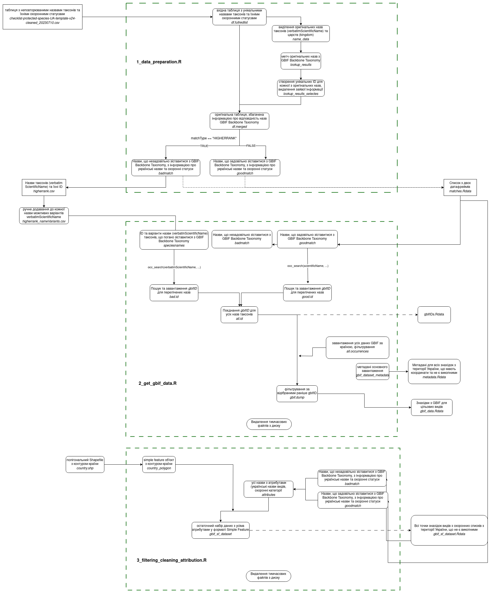

# GBIF_occurence_download

Pipeline for download occurrences for a series of scientific names, including taxonomic matching and problem resolving.




## The first step before building the Docker image

The script [**1_data_preparation.R**](scripts/1_data_preparation.R) for manual running. Don't use it on server.

> scripts/1_data_preparation.R 

The script takes a dataset with scientific names and conservation status info,  and returns two files: list of two with species lookup (matching) results, and csv with names require manual editing.

Inputs from folder [`data`](data) :
1. full spreadsheet with Latin names of taxa and data on their inclusion/status in various red lists `checklist-protected-species-....csv`.

Outputs to folder [`temp`](temp) :
1) `matches.Rdata` - list of two with the result of name matching.
   `[[1]]` - "goodmatch" - Names whose matching is satisfactory - we will then look for occurrences for these names using taxon keys.
   `[[2]]` - "badmatch" - Names whose matching is supposed to be wrong/unsatisfactory. We will then look for occurrences for these names using concatenated strings of possible verbatim scientific names.

2) `higherrank.csv` - csv file with Latin names that need to be completed by all possible verbatim scientific names available in GBIF manually.

The `temp/matches.Rdata` and `temp/higherrank.csv` files are used in the following steps, which are performed in the container.

Now you don't need to run the `scripts/1_data_preparation.R` script because the mentioned files are already ready.


## Build Docker image:


Before build product Docker image, you **need to change file** [`gbif_ini.R`](scripts/gbif_ini.R). You need to add your GBIF credentials into this file. 

> gbif_user = "your_GBIF_username"
>
> gbif_pwd = "your_GBIF_password"
>
> gbif_email = "your_email"

The next, run this command for build docker image:

```bash

docker build -t gbifwiever_datadamp_creator .

```

Run container based on our image.


For test you can run it with mounted local folders with temporary data.

```bash

docker run -it --rm --name gbif_datadump_creator -v "$(pwd)/outputs:/app/outputs"  gbifwiever_datadamp_creator

```


## Use Crontab for run conteiner by schedule

test run

```bash

docker run --rm --name gbif_datadump_creator -v "gbif_data:/app/outputs" gbifwiever_datadamp_creator

```

Edit Crontab 

```bash

crontab -e

```

Add line to Crontab

```bash

0 2 * * 7 docker run -it --rm --name gbif_datadump_creator -v "gbif_data:/app/outputs" antonbiatov/gbifwiever_datadamp_creator

```

