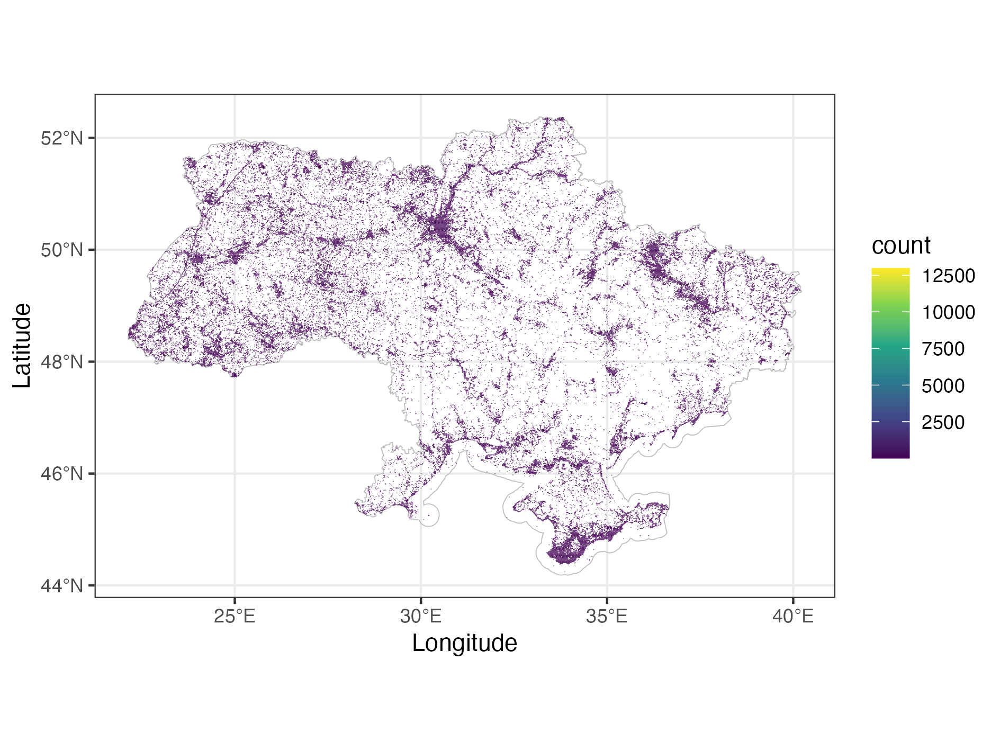

# GBIF_occurence_download
Pipeline for downloading occurrences for a series of scientific names with known conservation status, including taxonomic matching and problem resolving.

Based on [GBIF_occurence_download](https://github.com/olehprylutskyi/GBIF_occurence_download) by Oleh Prylutskyi.
																	
# Purpose
The main purpose of this pipeline was to obtain georeferenced occurrences unambiguously associated with the conservation status of the taxa they belong to. Existing tools, like `rgbif`, are doing well with retreiving occurrences for most species, but failed in cases when GBIF species matching tool (say, GBIF Backbone Taxonomy) faces difficulties.

Another issue with existing tools is even you provide a list of scientific names as an input, you received a list of occurrences which often have scientific names differ from the input ones, due to synonymy. It makes complicated to link attributes, assigned to the input names, with the retrieved occurrences.

The pipeline was developed within the project *GBIF Viewer: an open web-based biodiversity conservation decision-making tool for policy and governance* (The Habitat Foundation and Ukrainian Nature Conservation Group), funded by NLBIF: The Netherlands Biodiversity Information Facility, nlbif2022.014.

### Records of species posessing conservation status in Ukraine


# How to run the pipeline
This pipeline is 80% automatic, but still **requires manual operations** to resolve some difficult taxonomy issues. The reason of that is because the GBIF Backbone Taxonomy, which is generally used for name matching, may fail for some names, especially for poorly known or ambiguous taxa. For such exceptions user needs to manually edit *higherrank.csv* file, generated by *1_data_preparation.R*, before running *2_get_gbif_data.R*.

GBIF Backbone Taxonomy undergoes periodic (once a couple of months) update. After each one the list of names which faced difficulties with automatic matching is slightly changed. That means, user cannot use the same *higherrank.csv* for a long time. To facilitate revision of the *higherrank.csv*, run the script *1a_update_higherrank.R*. It automatically retrieve the data from the previous version of the file (named *higherrank_nameVariants_prev.csv*) and provide a handy GUI for manual revision only those names in which the matching issues appeared for the first time, not leaving your R session.

# Technical details

### Input:
- csv file with scientific names, their conservation status, and higher classification.

#3# Output:
- a `simple features` spatial data frame, containing georeferenced occurrences unambiguously associated with the conservation status of the taxa they belong to.

### Dependencies
- `rgbif` 
- `dplyr`, `tidyr`, and `stringr` for data manipulation
- `sf` for preparingworking with spatial data
- `DataEditR` for GUI for data frame revision
- `ggplot2` for visualisation (optional)

## The first step before building the Docker image

The script [**1_data_preparation.R**](scripts/1_data_preparation.R) for manual running. Don't use it on server.

> scripts/1_data_preparation.R 

The script takes a dataset with scientific names and conservation status info,  and returns two files: list of two with species lookup (matching) results, and csv with names require manual editing.

Inputs from folder [`data`](data) :
1. full spreadsheet with Latin names of taxa and data on their inclusion/status in various red lists `checklist-protected-species-....csv`.

Outputs to folder [`temp`](temp) :
1) `matches.Rdata` - list of two with the result of name matching.
   `[[1]]` - "goodmatch" - Names whose matching is satisfactory - we will then look for occurrences for these names using taxon keys.
   `[[2]]` - "badmatch" - Names whose matching is supposed to be wrong/unsatisfactory. We will then look for occurrences for these names using concatenated strings of possible verbatim scientific names.

2) `higherrank.csv` - csv file with Latin names that need to be completed by all possible verbatim scientific names available in GBIF manually.

The `temp/matches.Rdata` and `temp/higherrank.csv` files are used in the following steps, which are performed in the container.

Now you don't need to run the `scripts/1_data_preparation.R` script because the mentioned files are already ready.


## Build Docker image:


Before build product Docker image, you **need to change file** [`scripts/gbif_ini.R`](scripts/gbif_ini.R) . You need to add your GBIF credentials into this file. 

> gbif_user = "your_GBIF_username"
>
> gbif_pwd = "your_GBIF_password"
>
> gbif_email = "your_email"

The next, run this command for build docker image:

```bash

docker build -t biodiversityviewerviewer_datadamp_creator .

```

Run container based on our image.


```bash

docker run --rm --name gbif_datadump_creator -v "gbif_data:/app/gbif_data" -v "$(pwd)/temp_2:/app/temp_2" biodiversityviewerviewer_datadamp_creator

```


## Use Crontab for run conteiner by schedule

We will schedule the launch of the GBIF data dump creator every Sunday night.

Edit Crontab 

```bash

crontab -e

```

Add line to Crontab

```bash

0 2 * * 7 docker run --rm --name gbif_datadump_creator -v "gbif_data:/app/gbif_data" gbifviewer_datadamp_creator

```


# Schematic workflow

Pipeline for download occurrences for a series of scientific names, including taxonomic matching and problem resolving.


[Scalable diagram](https://drive.google.com/file/d/1K-X0aXqaWW6dZqWEjtTQBdtWS7i_5v1t/view?usp=sharing)