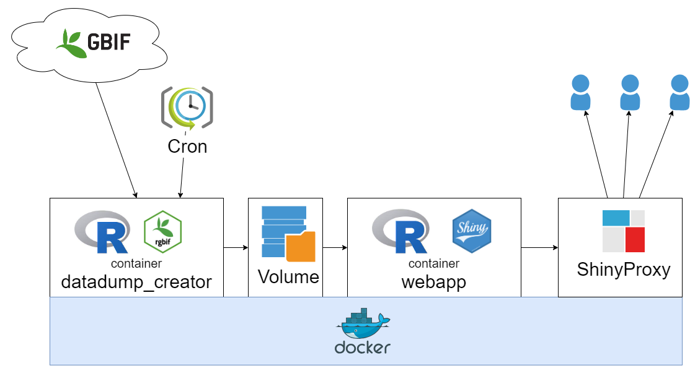

# Biodiversity Viewer. Module: Web Viewer

This repository provides several use cases for the application.
1. Use the application to work on your local computer;
2. Publish the application using Shiny Server Docker image;
3. Publish the application using Shiny Docker image to run using Shiny proxy.

## Use the application to work on your local computer

Application files are located in the [`app`](app) folder.


## Shiny Server

### Shiny Server Docker image

Build Web Biodiversity Viewer shiny server Docker image

```bash

docker build --file ./shiny_server.dockerfile -t biodiversity_viewer_shiny_server .

```

Run biodiversityviewer docker image

```bash

docker run -d --name shinyserver -p 3838:3838 -v "gbif_data:/srv/shiny-server/gbif_data" biodiversity_viewer_shiny_server

```

or

```bash

docker run -d --name shinyserver -p 3838:3838 -v "gbif_data:/srv/shiny-server/gbif_data" antonbiatov/biodiversity_viewer_shiny_server:latest

```


## ShinyProxy



### Configure docker 
you need to configure host docker [https://www.shinyproxy.io/documentation/getting-started/](https://www.shinyproxy.io/documentation/getting-started/) depende on type of operation system.

For example on Windows:

```
sc config docker binpath= "C:/Program Files/Docker/Docker/resources/dockerd.exe --run-service -H tcp://127.0.0.1:2375"

```


### Build Shiny Docker image to run in ShinyProxy

```bash

docker build --file ./shiny_app.dockerfile -t biodiversity_viewer_shiny_app .

```

Test run shiny app

```bash

docker run --rm -d --name biodiversityviewershinyapp -p 3838:3838 -v "gbif_data:/home/app/gbif_data" biodiversity_viewer_shiny_app

```

### Create shinyproxy network

```bash

docker network create shinyproxy-net

```

### Get ShinyProxy

```bash

docker build --file ./shinyproxy.dockerfile -t biodiversity_viewer_shinyproxy .

```


Test run shinyproxy

```bash

docker run --rm -it --name shinyproxy -v "//var/run/docker.sock:/var/run/docker.sock" --net shinyproxy-net -p 8080:8080 biodiversity_viewer_shinyproxy

```

Run SinyProxy 

```bash

docker run -d -v /var/run/docker.sock:/var/run/docker.sock --net sp-example-net --name shinyproxy -p 8080:8080 biodiversity_viewer_shinyproxy

```

