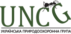

`r text_with_date`

# Photo Log

This is a numeric value: `r toString(numeric_value)`.

## Photographer
```{r, echo = FALSE}
knitr::kable(params$df)
```


```{r, echo = FALSE}
knitr::kable(dat$images)
```


summary cars

```{r cars}
summary(cars)
```

head cars
```{r , echo = FALSE}
knitr::kable(cars)

```

Generate pic

```{r pressure, echo=FALSE}
plot(pressure)
```

**GBIF Viewer**: an open web-based biodiversity conservation decision-making tool for policy and governance. Спільний проєкт The [Habitat Foundation](https://thehabitatfoundation.org/) та [Української Природоохоронної Групи](https://uncg.org.ua/), за підтримки [NLBIF: The Netherlands Biodiversity Information Facility](https://www.nlbif.nl/), nlbif2022.014

 


